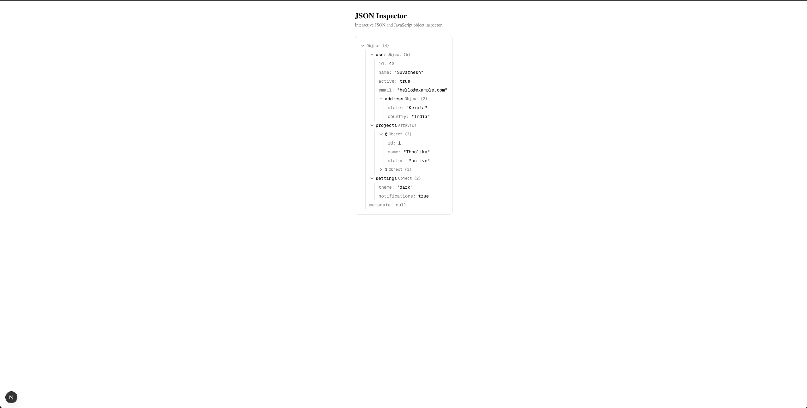

# Varnus

Components for developer-facing interfaces.

Varnus is a growing collection of reusable [shadcn/ui](https://ui.shadcn.com/) components for inspecting, debugging, and visualizing developer data.

## Components

### JSON Inspector

Interactive JSON and JavaScript object inspector with search, expandable nodes, copy actions, and circular reference detection.

```bash
bunx shadcn@latest add notinsect/json-inspector/json-inspector
```

### JSON Diff

Expandable JSON and JavaScript diff viewer for shadcn/ui that highlights added, removed, modified, and unchanged values.

```bash
bunx shadcn@latest add notinsect/json-inspector/json-diff
```

### Request / Response Viewer

Inspect HTTP requests and responses with headers, query parameters, structured bodies, status information, copy actions, and sensitive-value redaction.

```bash
bunx shadcn@latest add notinsect/json-inspector/request-response-viewer
```



## Features

- Expandable and collapsible object tree
- Expand all / collapse all
- Search keys and values
- Automatic expansion while searching
- Search result highlighting
- Copy values
- Copy object paths
- Circular reference detection
- Configurable default expansion depth
- Dark mode support
- Type-aware syntax colors
- TypeScript support
- Works with shadcn/ui projects

### Supported values

- Objects
- Arrays
- Strings
- Numbers
- Booleans
- `null`
- `undefined`
- `Date`
- `RegExp`
- `BigInt`
- Functions
- `Map`
- `Set`
- `Error`
- Circular references

## Installation

Install directly using the shadcn CLI:

```bash
bunx shadcn@latest add notinsect/json-inspector/json-inspector
```

Or with pnpm:

```bash
pnpm dlx shadcn@latest add notinsect/json-inspector/json-inspector
```

Or npm:

```bash
npx shadcn@latest add notinsect/json-inspector/json-inspector
```

The component will be added to your configured shadcn UI components directory.

## Usage

```tsx
import { JsonInspector } from "@/components/ui/json-inspector";

const data = {
  id: 1042,
  title: "Example Project",
  active: true,
  account: {
    username: "demo-user",
    verified: false,
  },
  tags: ["React", "Next.js", "TypeScript"],
};

export default function Example() {
  return <JsonInspector data={data} searchable defaultExpandedDepth={2} />;
}
```

## Props

| Prop                   | Type      | Default | Description                         |
| ---------------------- | --------- | ------- | ----------------------------------- |
| `data`                 | `unknown` | —       | Data to inspect                     |
| `searchable`           | `boolean` | `true`  | Enables the search input            |
| `defaultExpandedDepth` | `number`  | `2`     | Number of levels expanded initially |

## JavaScript types

JSON Inspector isn't limited to JSON-compatible values. It can also inspect common JavaScript values.

```tsx
const data = {
  createdAt: new Date("2026-01-15T09:30:00.000Z"),
  pattern: /example/gi,
  largeNumber: BigInt("9007199254740991"),

  greet() {
    return "Hello!";
  },

  map: new Map([
    ["theme", "dark"],
    ["language", "en"],
  ]),

  set: new Set(["React", "Next.js", "TypeScript"]),

  error: new Error("Example error message"),
};
```

```tsx
<JsonInspector data={data} />
```

> When using values such as `Map`, `Set`, `RegExp`, functions, or `Error` in a Next.js App Router demo, create them within a Client Component rather than passing them from a Server Component to a Client Component.

## Search

Enable search with:

```tsx
<JsonInspector data={data} searchable />
```

Search checks both keys and values. Matching branches are automatically expanded and matching text is highlighted.

Disable it with:

```tsx
<JsonInspector data={data} searchable={false} />
```

## Default expanded depth

Control how deeply the tree is initially expanded:

```tsx
<JsonInspector data={data} defaultExpandedDepth={3} />
```

For example:

```text
$                    depth 0
└── account          depth 1
    └── preferences  depth 2
```

## Circular references

Circular structures are detected automatically instead of recursively rendering forever.

```tsx
const user: Record<string, unknown> = {
  name: "Demo User",
}

user.self = user

<JsonInspector data={user} />
```

Circular references are displayed as:

```text
[Circular]
```

## Copy actions

Hover over a row to access copy actions.

Primitive values can be copied directly, and paths can be copied for navigating deeply nested structures.

Example paths:

```text
$.account.username
$.projects[0].name
```

## Styling

JSON Inspector uses Tailwind CSS and shadcn/ui theme tokens such as:

```text
background
foreground
muted
muted-foreground
border
ring
```

This allows it to adapt automatically to your shadcn theme and dark mode.

## Development

Clone the repository:

```bash
git clone https://github.com/notinsect/json-inspector.git
cd json-inspector
```

Install dependencies:

```bash
bun install
```

Start the development server:

```bash
bun dev
```

Run lint:

```bash
bun run lint
```

Create a production build:

```bash
bun run build
```

## Registry

This repository can be used directly as a shadcn GitHub registry.

Install the component with:

```bash
bunx shadcn@latest add notinsect/json-inspector/json-inspector
```

The registry definition is available in [`registry.json`](./registry.json).

## License

MIT
